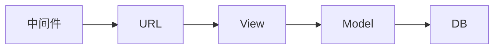
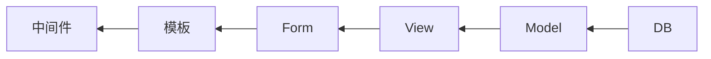

# 前言

## Web服务器概述

### 最简单的web服务器

最简单的Web服务器的原理可以利用python的`socket`模块实现，步骤大致如下：

1. 创建一个套接字，并与本机的某个端口绑定，
2. 监听该端口，。
3. 接受请求，创建发送端口，
4. 发送HTTP响应报文序列化后的字节流

### WSGI
WSGI是Python定义的一个网关协议，类似Java的Servlet，规定了Web Server和应用程序如何交互（容器）。

Web协议，包括Server、MiddlewApplication。

#### WSGI Server
WSGI Server，主要是实现相应的信息转换，将网络请求中的信息，按照HTTP协议将内容拿出，同时按照WSGI协议组装成新的数据，同时将提供的`start_response`传递给Application。最后接收Application返回的内容，按照WSGI协议解析出。

- Gunicorn：WSGI服务器，
- Werkzeug：WSGI的底层库。

以上两个似乎是较为有名的WSGI容器，类似Tomcat之于Servlet，关于WSI与Servlet的差别可以参考[《wsgi versus servlet》](https://www.cnblogs.com/jackiesteed/articles/4287223.html)。

#### WSGI Application。
WSGI Application是个可重复调用的可调用对象，可以是函数、类，甚至迭代器。需要能够接受两个参数`environ`和`start_response`。

- environ是web服务器解析HTTP协议的一些信息，例如请求方法，请求URI等信息构成的一个Dict对象。
- start_response是一个函数，接收2个参数，一个是HTTP状态码，一个HTTP消息中的响应头。

## Django开发框架

### 框架特点
Django的特点是全功能，特点包括但不限于：

- HTTP封装
- ORM
- admin
- Form
- template
- session和cookie
- 权限
- 安全
- cache
- Logging
- sitemap
- RSS

### 目录结构
Django是一个基于WSGI的MTV框架。

- 请求

- 响应

## 参考资料
1. [WEB开发——Python WSGI协议详解](https://zhuanlan.zhihu.com/p/66586001)