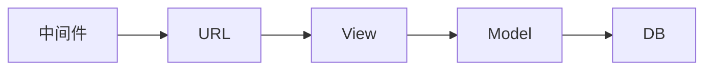
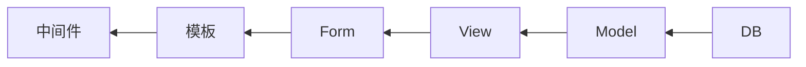

# 背景知识

## Web服务器概述

### 最简单的web服务器

最简单的Web服务器的原理可以利用python的`socket`模块实现，步骤大致如下：

1. 创建一个套接字，并与本机的某个端口绑定，
2. 监听该端口
3. 接受请求，创建发送端口
4. 发送HTTP响应报文序列化后的字节流

### WSGI
WSGI是一种Web协议，包括WSGI Gateway和WSGI Application。

对于WSGI Application，需要能够接受一和环境变量和回调函数，这个回调函数用来设置response的**状态**和**Header**。

- Gunicorn：WSGI服务器，
- Werkzeug：WSGI的底层库。

## Django开发框架

### 特点
Django的特点是全功能，特点包括但不限于：

- HTTP封装
- ORM
- admin
- Form
- template
- session和cookie
- 权限
- 安全
- cache
- Logging
- sitemap
- RSS

### 结构
Django是一个基于WSGI的MTV框架。

