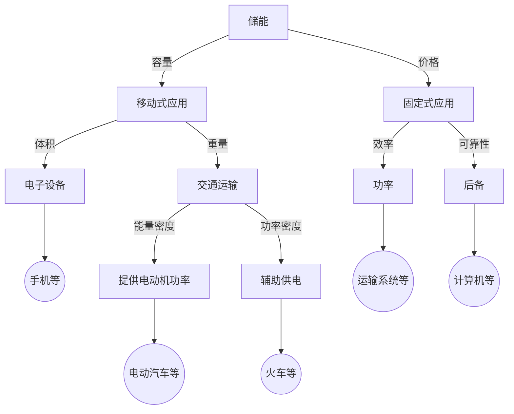

# 储能技术概述

## 发展背景
| 环节 | 挑战 | 收益 | 需求 | 技术选型 |
|------|-----|------|------|---------|
| 燃料 | 挥发性 | 防范风险 |||
| 发电 | 载荷低 | 随意性 | 大容量、大功率 | 抽水蓄能、压缩空气 |
| 输电 | 阻塞 | 高利用率 | | |
| 配电 | 安全性 | 稳定 | | |
| 用电 | 电能 | 电能质量 | | |

## 技术型式
不同的技术类型会有不能的响应速度（秒级、分钟级，小时级），经济效益和适用场景不同。

关键技术经济指标包括：
- 功率密度、比功率
- 能量密度、比能量
- 额定续航时间
- 响应速度/作用时间
- 出力频次
- 循环寿命、日历寿命
- 能量效率
- 可靠性/安全性
- 电池成本/度电成本

### 物理储能
- 抽水蓄能：能量密度比较低，技术比较成熟
- 压缩空气储能
- 飞轮储能：响应速度非常快，能为电力系统提供惯性和短路容量
- 重力储能：
    - 混凝土块积木式重力储能
    - 水力岩石重力储能
    - 深水蓄能重力储能

### 电化学储能
$$电池 = 正极 + 负极 + 薄膜 + 电解液$$

- 锂离子电池（电动汽车）
    - 三元电池
    - 磷酸铁锂电池
- 钠硫电池
- 铅碳电池
- 液流电池
    - 全矾液流
    - 多硫化钠液流
    - 锌溴液流
    - 铁铬液流
- 钛酸锂电池
- 钠离子电池（最新）
- 储热与燃机
- 可逆PAC储氢

### 电磁储能
- 超导储能
- 超级电容器

## 应用场景
不同的应用场景需要使用不同的储能技术，包括容量、价格、体积、重量、效率、可靠性、能量密度、功率密度、效率等。

- 提高发电收益（峰谷差套利）
- 降低运行风险
- 需求侧响应（电价）
- 调频
- 电压调节（电能质量）
- 电网故障恢复
- 平滑可再生能源（间歇式）发电

## 储能技术标准

### 标准委员会
- 全国电力储能标准化技术委员会
- 中关村储能产业技术联盟

### 标准体系
#### 国家标准
- 电化学储能电站设计规范（GB 51048-2014）
- 电力储能用锂离子电池
- 电力储能用铅碳电池
- 电化学储能系统储能变流器技术规范
- 储能变流器检测规程
- 电化学储能系统接入电网技术规定
- 电化学储能接入电网检测规范

#### 行业标准

#### 团体标准

#### IEEE标准

#### IEC标准

#### 企业标准
- 储能系统接入配电网技术规定（Q/GDW 1564-2014）
- 储能系统接入配电网监控系统功能规范（Q/GDW 697-2011）
- 储能系统接入配电网技术规定（Q/GDW 564-2010）
- 电池储能电站技术导则（Q/GDW 1769-2012）
- 电池储能系统集成典型设计规范（Q/GDW 1886-2013）
- 电网配置储能系统监控及通信技术规范（Q/GDW 1887-2013）

### 标准类型
- 基础通用类
- 规划设计类
- 施工及验收类
- 运行维护类
- 检修类
- 设备及试验类
- 安全环保类
- 技术管理类

### 平台认证
- CNAS级储能设备性能检测平台
- 储能产品认证平台
- 大容量储能系统并网适应性（试验）检测平台

