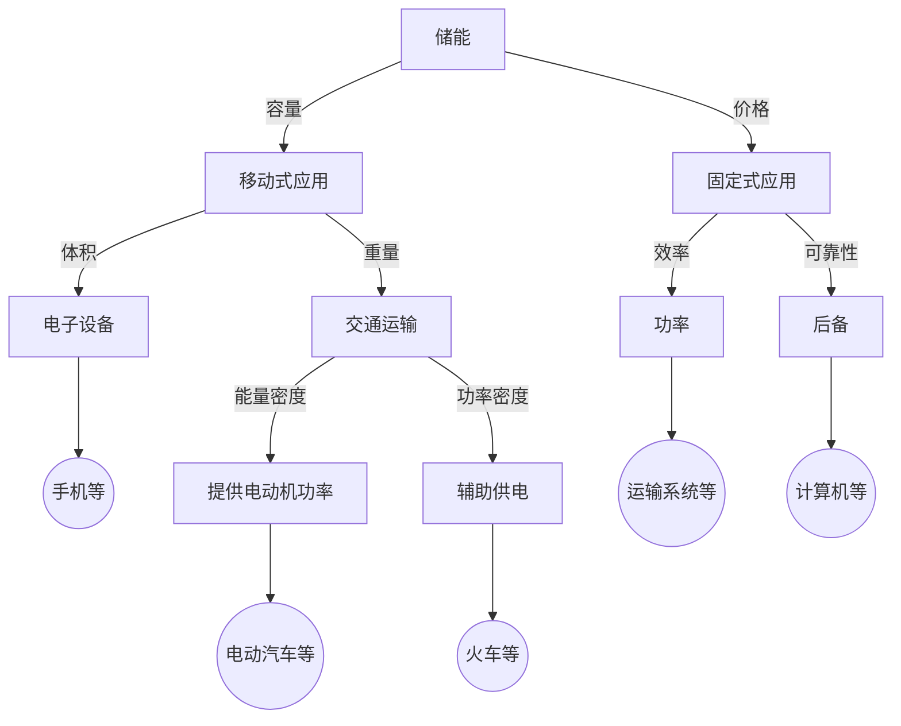

# 储能技术概述

## 储能的效益
| 环节 | 挑战 | 收益 | 需求 | 技术选型 |
|------|-----|------|------|---------|
| 燃料 | 挥发性 | 防范风险 |||
| 发电 | 载荷低 | 随意性 | 大容量、大功率 | 抽水蓄能、压缩空气 |
| 输电 | 阻塞 | 高利用率 | | |
| 配电 | 安全性 | 稳定 | | |
| 用电 | 电能 | 电能质量 | | |

- 发电企业效益
    - 降低燃料费用，负荷转移或平滑负荷曲线
    - 优化市场中的电量销售策略
    

## 影响储能技术的因素

不同的需求需要使用不同的储能技术，包括容量、价格、体积、重量、效率、可靠性、能量密度、功率密度、效率等。

## 储能技术类型
### 大容量储能技术
- 抽水蓄能：能量密度比较低，技术比较成熟
- 地下压缩空气
- 电化学电池：成本较高
- 液流电池
- 储热与燃机

### 中小容量储能技术
- 超导储能
- 超级电容器
- 电化学电池
- 飞轮储能
- 罐装压缩空气
- 可逆PAC储氢
