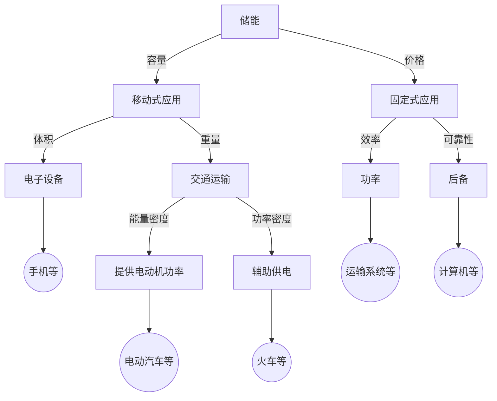

# 储能技术概述

## 发展背景
| 环节 | 挑战 | 收益 | 需求 | 技术选型 |
|------|-----|------|------|---------|
| 燃料 | 挥发性 | 防范风险 |||
| 发电 | 载荷低 | 随意性 | 大容量、大功率 | 抽水蓄能、压缩空气 |
| 输电 | 阻塞 | 高利用率 | | |
| 配电 | 安全性 | 稳定 | | |
| 用电 | 电能 | 电能质量 | | |

- 发电企业效益
    - 降低燃料费用，负荷转移或平滑负荷曲线，平滑极端峰值负荷。
    - 优化市场中的电量销售策略。
    - 减轻影响发电机组运行和管理的多种动态约束条件，通过平滑负荷曲线以优化发电机组的运行。
    - 降低CO2的排放水平，相应减少购买碳排放许可的费用。
- 输电企业效益
- 用电企业效益

## 技术选型
不同的技术类型会有不能的响应速度（秒级、分钟级，小时级），经济效益和适用场景不同。

关键技术经济指标包括：
- 功率密度、比功率
- 能量密度、比能量
- 额定续航时间
- 响应速度/作用时间
- 出力频次
- 循环寿命
- 能量效率
- 可靠性/安全性
- 电池成本/度电成本

### 物理储能
- 抽水蓄能：能量密度比较低，技术比较成熟
- 压缩空气储能
- 飞轮储能：响应速度非常快，能为电力系统提供惯性和短路容量
- 重力储能：
    - 混凝土块积木式重力储能
    - 水力岩石重力储能
    - 深水蓄能重力储能

### 电化学储能
$$电池 = 正极 + 负极 + 薄膜 + 电解液$$

- 锂离子电池（电动汽车）
    - 三元电池
    - 磷酸铁锂电池
- 钠硫电池
- 铅碳电池
- 液流电池
    - 全矾液流
    - 多硫化钠液流
    - 锌溴液流
    - 铁铬液流
- 钛酸锂电池
- 钠离子电池（最新）
- 储热与燃机
- 可逆PAC储氢

### 电磁储能
- 超导储能
- 超级电容器

## 应用场景

不同的应用场景需要使用不同的储能技术，包括容量、价格、体积、重量、效率、可靠性、能量密度、功率密度、效率等。

### 调频
调频一般要求响应速度为秒级，甚至是毫秒级。

- 一次调频：对参与调频发电机组进行直接的和自动的发电控制，以维持发电系统的实时发电-用电平衡，仅利用本地信息即可实现。

$$P=P_0 + k(f - f_0)$$

对备用容量的响应时间有一定的要求。

- 二次调频：对参与调频的发电机组进行集中式自动调节，以使系统频率及与相邻电网的功率交换达到预定目标值，不是利用本地信息实现。

- 三次调频：手动调频，在二次调频没能实现调节目标时，或电力供需不平衡缓慢增大时，使系统重新恢复到平衡状态。

### 电网恢复
- 黑启动

### 间歇式电源接入
- 新能源调峰
- 平滑可再生能源发电

### 峰谷差套利

### 需求侧响应
