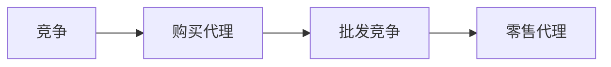

# 能源经济概述

电力市场的成员角色如下表
| 中文名 | 英文名 |
|--|--|
| 垂直一体化公用事业 | Vertically integrated utility |
| 发电企业 | generating company, Genco |
| 配电企业 | distribution company, Disco |
| 零售商 | retailer |
| 市场运营商 | market operator, MO |
| 独立系统运营商 | independent system operator, ISO |
| 输电企业 | transmission company, Transco |
| 独立输电企业 | independent transmission company, ITC |
| 监管组织 | regulator |
| 小用户 | small consumer |
| 大用户 | large consumer |

电力市场的竞争模式发展如下图所示：

